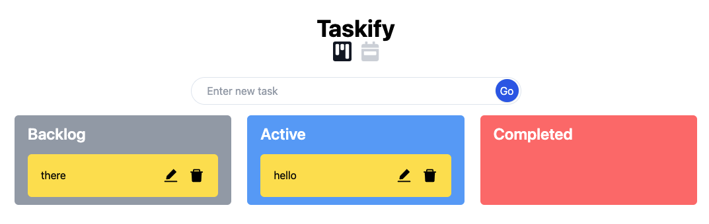
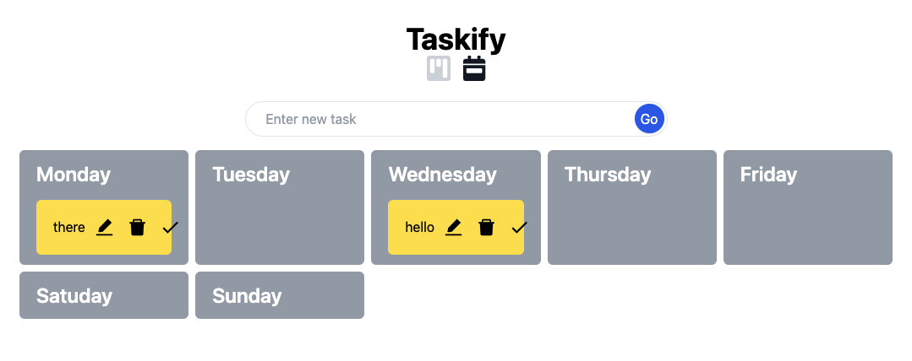
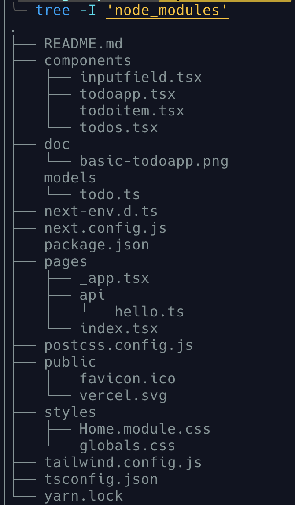

# A simple Drag-and-Drop Todo App



 

## Tech Stack   
- [Next.js](https://nextjs.org/) - The React Framework for Production 
- [Tailwind CSS](https://tailwindcss.com/) - A utility-first CSS framework 
- [Typescript](https://www.typescriptlang.org/)  - A typed JavaScript 
- [Nvim](https://neovim.io/) - A Vim-based Text Editor 
- [react-beautiful-dnd](https://github.com/atlassian/react-beautiful-dnd) - A React library to create dnd effects. 

## Project Structure 


## Getting Started

First, run the development server:

```bash
yarn dev
```
Open [http://localhost:3000](http://localhost:3000) with your browser to see the result.

### Modes and Environment Variables
Two modes:
  - `development` is used by `yarn dev`
  - `production` is used by `yarn build` 

When running building, environment variables are loaded from the following files in your project root:

```
.env                # loaded in all cases
.env.local          # loaded in all cases, ignored by git
.env.[mode]         # only loaded in specified env mode
.env.[mode].local   # only loaded in specified env mode, ignored by git
```

## About me
- [Portfolio Website](https://www.amyjuanli.com/) - A place to write blog and display my works. 
- [Medium Blog](https://amy-juan-li.medium.com/) - Another blogging platform. 
- [eBook: Become a software developer without computer science degree](https://amyjuanli.gumroad.com/l/wplun)
- [SkillShare Class: Empower your life by becoming a software developer without a computer science degree.](https://www.skillshare.com/classes/Empower-your-life-Become-a-software-developer-without-a-CS-degree/1243883176)
