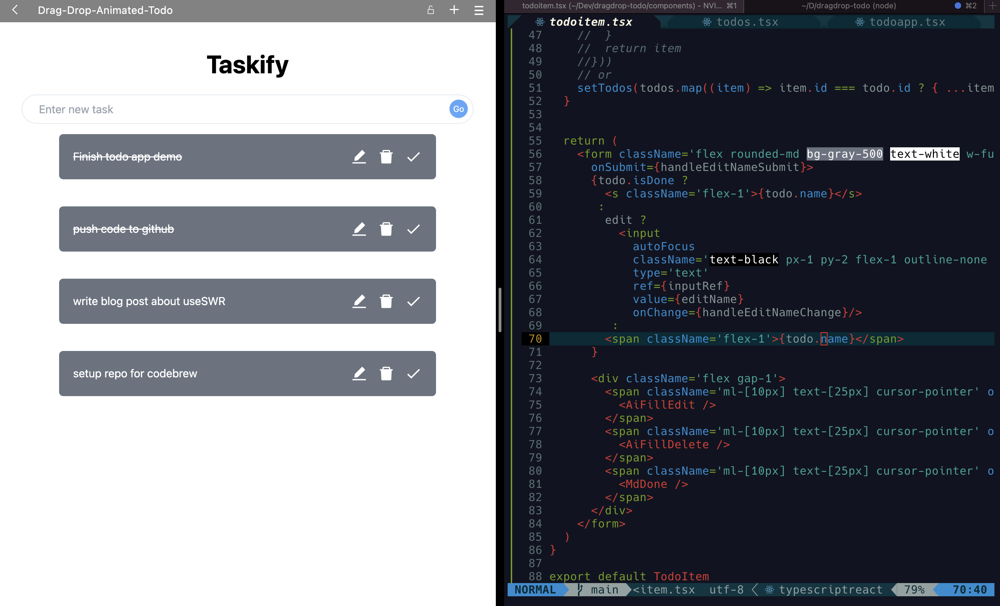
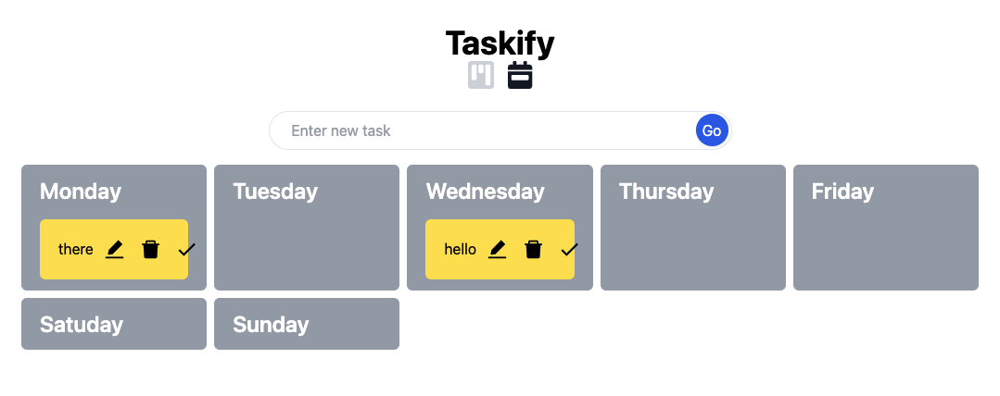
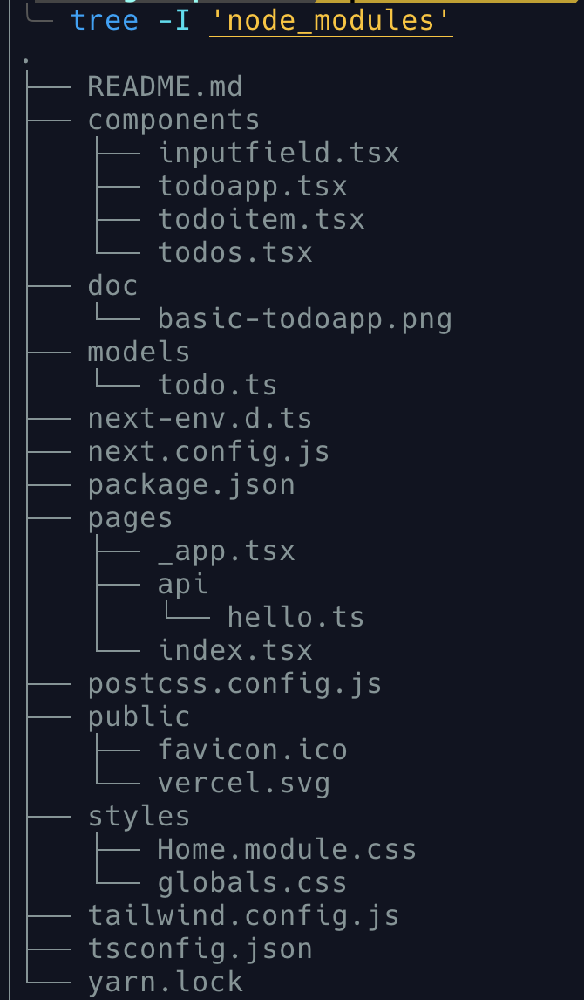
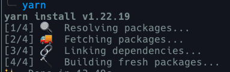
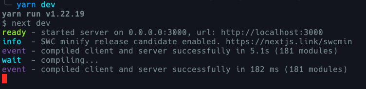

# A simple Drag-and-Drop Todo App

Features:   
- Two views to toggle: Kanban View and Weekly View. 
- You can create new task by press enter key after filling the content in the input box. 
- You can easily update and delete task by clicking the icon buttons on the right side of each task. 
- You can drag and drop task to update their status.


 



## Tech Stack   
- [Next.js](https://nextjs.org/) - The React Framework for Production 
- [Tailwind CSS](https://tailwindcss.com/) - A utility-first CSS framework 
- [Typescript](https://www.typescriptlang.org/)  - A typed JavaScript 
- [Nvim](https://neovim.io/) - A Vim-based Text Editor 
- [react-beautiful-dnd](https://github.com/atlassian/react-beautiful-dnd) - A React library to create dnd effects. 

## Project Structure 


## Getting Started
- Git clone this repo
- Install all dependencies:  

```bash
yarn
# or 
yarn install
```

 
- Run the development server:

```bash
yarn dev
```


Open [http://localhost:3000](http://localhost:3000) with your browser to see the result.

### Modes and Environment Variables
Two modes:
  - `development` is used by `yarn dev`
  - `production` is used by `yarn build` 

Environment Variables Load Order
Environment variables are looked up in the following places, in order, stopping once the variable is found.

`process.env`  
`.env.$(NODE_ENV).local`  
`.env.local` (Not checked when NODE_ENV is test.)  
`.env.$(NODE_ENV)`  
`.env`

Learn more: https://nextjs.org/docs/basic-features/environment-variables

## Relevant articles
- (Learn to Build NextJS Applications)(https://medium.com/r/?url=https%3A%2F%2Famy-juan-li.medium.com%2Flist%2Fdb243e7bdf05)
- [Build a Markdown Editor Using Electron, React, TypeScript, CodeMirror 6, and Remark](https://medium.com/r/?url=https%3A%2F%2Famy-juan-li.medium.com%2Fbuild-a-markdown-editor-using-electron-reactjs-vite-codemirror-and-remark-e551d91b6233)

## About me
- [Portfolio Website](https://www.amyjuanli.com/) - A place to write blog and display my works. 
- [Medium Blog](https://amy-juan-li.medium.com/) - Another blogging platform. 
- [eBook: Become a software developer without computer science degree](https://amyjuanli.gumroad.com/l/wplun)
- [SkillShare Class: Empower your life by becoming a software developer without a computer science degree.](https://www.skillshare.com/classes/Empower-your-life-Become-a-software-developer-without-a-CS-degree/1243883176)
